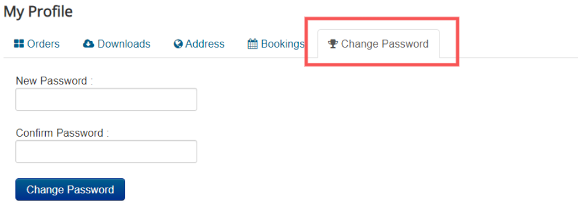

# Change Password

This app enables change password feature in J2Store's My Profile page. It allows customer to change their account's password in their profile page.

## Requirements:

* PHP 5.4 or higher
* Joomla 3.3 or above
* J2Store 3.2.x or above

## Installation:

1. Download the Change Password App and install it using Joomla installer.
2. After installing the app, go to J2Store &gt; Apps and enable Change Password app.
3. Click Enable in the Change Password App.
4. Once the app is enabled, click on Open to set the configuration for the app.
5. Once enabled, go to My Profile page at store frontend, login and you can see one more additional tab appears named Change Password. 
6. Click on this tab and try changing your password. 

