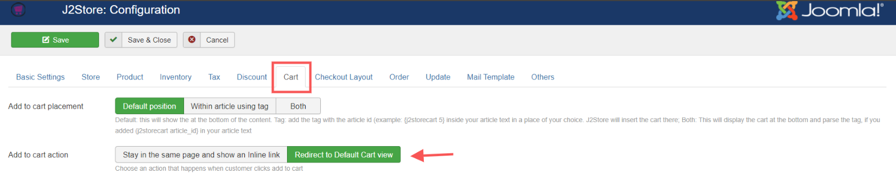

# Checkout Redirect

The app will redirect the customer directly to checkout when they add an item to cart, skipping the cart page.

## Requirements:

* PHP 5.4 or higher
* Joomla 3.3 or above
* J2Store 3.1.1 or above

## **Installation:**

1. Download the **Checkout Redirect** App and install it using Joomla installer.
2. After installing the app, go to J2Store > Apps and enable Change Password app.
3. Click Enable in the Checkout Redirect App.
4. Once the app is enabled, click on Open to set the configuration for the app.
5. Once enabled, when you add an item to cart the store will redirect you to the Checkout page and thus hide the Cart page from customer view.

**NOTE:** You should set the Cart behavior to Redirect in J2Store ->Set up-> Configuration->Cart tab

\
