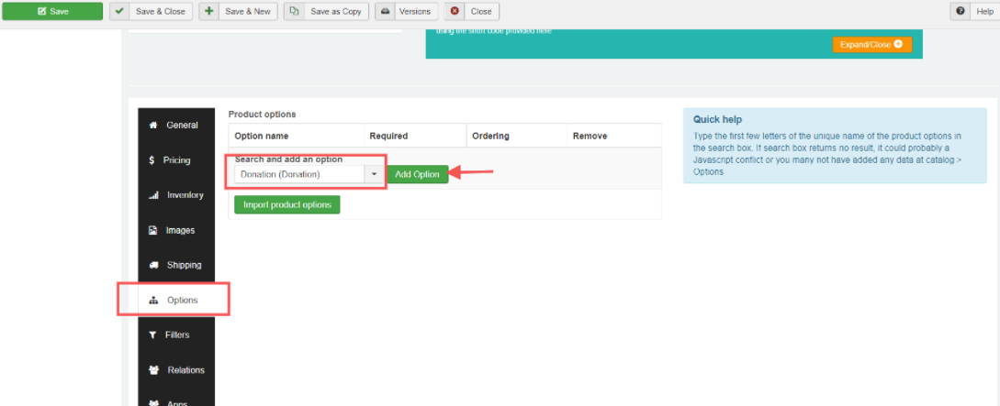
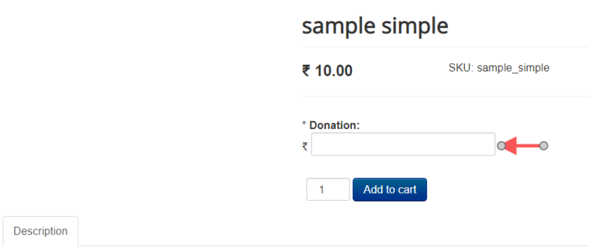

# Donation

The app adds donation as a product option, allowing the store owners to collect donation in addition to selling their products.

The customer will be able to enter the amount of the donation in a text box. You give the liberty of choosing the amount to your user.

The app seamlessly integrates with J2Store. You will be able to create a donation option type and associate it with the product. No complex configuration is required to use this app. Just install the plugin over your site, start creating option and add it to as many products as you like.  

## **Limitations:**

When using the donation option type, avoid using another option with a price modifier \(like a select or radio type option that adds / modifies the price\)

## Requirements:

* PHP 5.4 or higher
* Joomla 3.3 or above
* J2Store 3.2.x or above

## Installation:

* Download Donation app from our site and install it using Joomla installer.
* After installing, from Joomla backend go to J2Store &gt; Apps and find Donation app.
* Click on Enable to activate the app.

## How to Set Donation Option for a Product?

Once you have enabled the Donation App under J2Store &gt; Apps, then you may consider creating an Option of the type Donation by navigating to J2tore-&gt;Catalog-&gt;Options-&gt;New-&gt;Type-&gt;Donation.

Once you have created the Option type as Donation you may add the option type to your desired product that you wish to receive the donation for by navigating to J2Store-&gt;Catalog-&gt;Products-&gt;Select your product.

Under J2Store cart tab-&gt;Options tab-&gt;Select the Donation option you created and click on Add option.

Save the changes.

Now your store frontend should display the Donation option for the respective Product.

