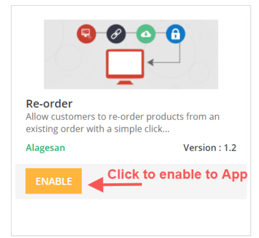
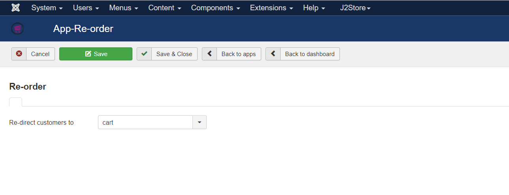
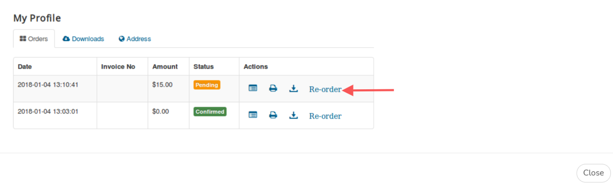

# Re-Order

Allow your customers to re-order with a single click.

Instead of going through the process of adding the same products in their next purchase, let them re-order. All they have to do is click the a button / link from their order-history (my profile) page.

## **Requirements:**

* PHP 5.4 or higher
* Joomla 3.3 or above
* J2Store 3.2.x or above

## **Installation:**

1. Download the Re-Order App and install it using Joomla installer.
2. After installing Re-Order, in the backend, go to J2Store Dashboard -> Apps
3. Click Enable in the Re-Order App.
4. Once the app is enabled, click on Open to set the configuration for the app.

## Configuration:

Once you have Enabled the Re-Order App under J2Store->Apps, the app places a button in the My profile page, allowing users to re-order the items of an existing order, in a few clicks.

Now click on "Open" under to J2Store->Apps->Re-Order configure the App.

Select the page that the customer should be redirected to post clicking on the Re-Order button displayed next to the order placed by customer at the My profile page.

Now when the customer has placed order for a product and want to re-order the same product they visit the My profile page and click on the "Re-order" button to be directed to either the Cart page or Checkout page (Based on redirect option you set at store backend) and then complete placing the order further from there.

\

