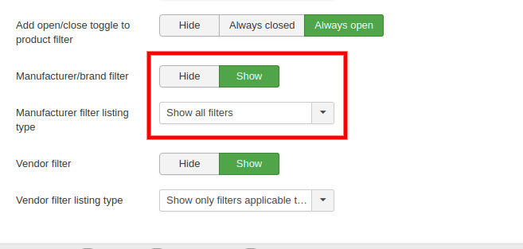
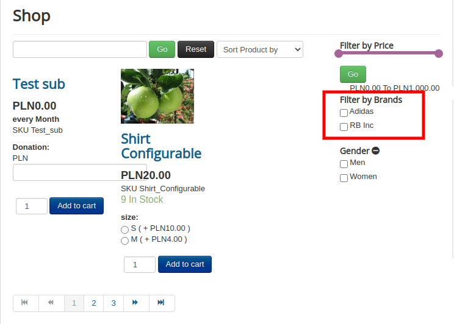

# Manufacturers

This page contains information about the manufacturers of the products that are listed in J2Store.

Manufacturers are listed with the following details:

* Company
* Tax Number
* Address
* City
* Zip
* Phone and Mobile
* Country
* Zone

Image shown below is how a manufacturer is added.

## Associating them to products 

To add the manufacturers to the product, follow the below instructions:

* Navigate to J2Store-&gt;Catalog-&gt;Products-&gt;Your product-&gt;J2Store cart-&gt;General.
* Click on the manufacturers dropdown box.
* The list of available manufacturers would be available.
* Choose your manufacturer and save.

* Navigate to Menu manager-&gt;Your product’s menu-&gt;Item view options tab
* Set the option Brand to Yes.
* This would display the associated brand on the product view as follows:

## Frontend 

#### **Filtering products based on manufacturers/brands:**

Once you associate manufacturers with the appropriate products, you can also let users filter products based on brands.

* Post linking brands with the concerned products,  navigate to Menu manager-&gt; Your product menu-&gt; Item view in category listings tab.
* Scroll down to the Filters section. Set the option: **Manufacturer/brand filter** to Show.
* Set the option **Manufacturer filter listing type** to **Show all filters.**

* Once the manufacturer filters are enabled, the filters would be listed and users can filter the products based on brands.

