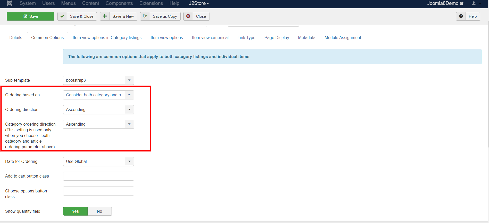

# Ordering products on your storefront

Organizing your products is an important factor to increase the user-friendliness of your store. The following article describes how your products could be organized.

## Options available: 

Ordering options could be found under Menu manager-&gt;Your product’s menu item-&gt;Common options tab-&gt; Article order.

### The following are the options: 

**Use global** - This would display the articles in the order as specified on the Joomla Global c configuration\(under System-&gt;Global configuration-&gt;Articles-&gt;Shared-&gt;Article order\).  

**Featured products\(articles\) first**- The products that are marked as featured, would be listed first followed by the others.

**Most recent first** - The most recently created products/ articles would be listed first. **Oldest first**- This option would allow the product that are the oldest to be displayed first. 

**Title alphabetical**- With this option you could sort your products based on their titles in alphabetical order. **Title reverse alphabetical**- This option would sort the products in the reverse alphabetical order. 

**Author Alphabetical**- The products would be sorted based on their author names alphabetically.  **Author reverse alphabetical**- Products will be ordered based on their author names in reverse alphabetical order. 

**Most hits**- The products that have received most hits would be listed first. **Least hits**- The products with the least hits would appear first. 

**Article order**- The order in which they are sorted in the Content-&gt;articles part would be the order of the products at the **F**rontend.

**Consider both Category and Article ordering :** This option you could sort your Categories and also the products/articles within the Category either in Ascending or Descending order. This option would be reflected only if the Following option is also set as Ascending or Descending depending on your requirement under **Menu manager-&gt;Your product’s menu item-&gt;Common options tab-&gt;**Ordering direction and the Category ordering direction.

\*\*\*\*

\*\*\*\*

### Video Tutorial: 



