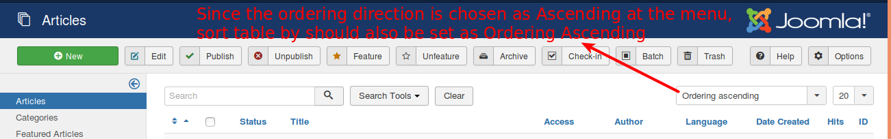
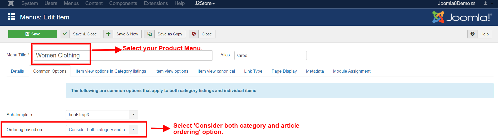
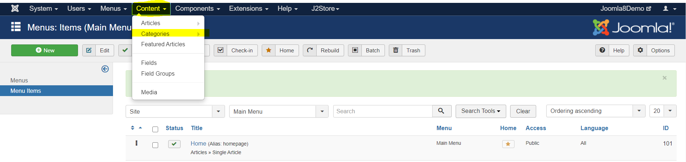
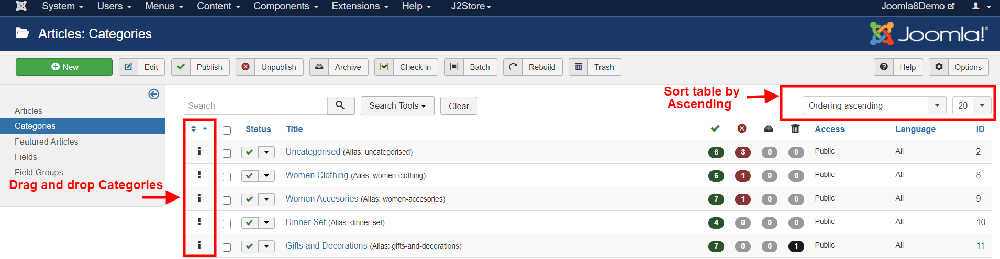
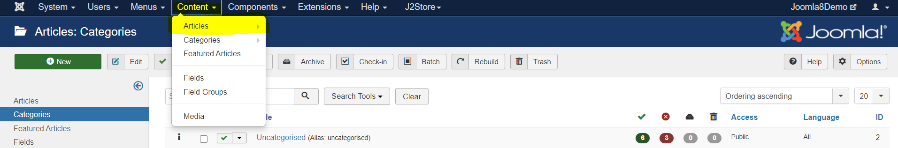
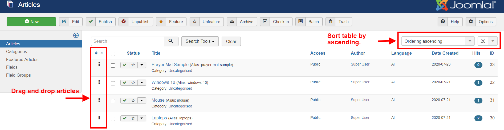

# Ordering products on your storefront

Organizing your products is an important factor to increase the user-friendliness of your store. The following article describes how your products could be organized.

## Options available: 

Ordering options could be found under Menu manager-&gt;Your product’s menu item-&gt;Common options-&gt; Article order.

### The following are the options: 

**Use global** - This would display the articles in the order as specified on the Joomla Global c configuration\(under System-&gt;Global configuration-&gt;Articles-&gt;Shared-&gt;Article order\).  

**Featured products\(articles\) first**- The products that are marked as featured, would be listed first followed by the others.

**Most recent first** - The most recently created products/ articles would be listed first. **Oldest first**- This option would allow the product that are the oldest to be displayed first. 

**Title alphabetical**- With this option you could sort your products based on their titles in alphabetical order. **Title reverse alphabetical**- This option would sort the products in the reverse alphabetical order. 

**Author Alphabetical**- The products would be sorted based on their author names alphabetically.  **Author reverse alphabetical**- Products will be ordered based on their author names in reverse alphabetical order. 

**Most hits**- The products that have received most hits would be listed first. **Least hits**- The products with the least hits would appear first. 

**Article order**- The order in which they are sorted in the Content-&gt;articles part would be the order of the products at the **F**rontend.

**Consider both Category and Article ordering :** This option you could sort your products based on the ordering of the Categories and also the products/articles within the Category either in Ascending or Descending order. 

**Ordering Direction& Category Ordering Direction:**

 Choose whether the Product Articles should be ordered alphabetically from A to Z\(ascending\) or from Z to A\(descending\).

The value you choose here should be the same as the one chosen under Content-&gt;Articles-&gt;Sort Table by:

Similarly for the category ordering direction, the value chosen at the menu should match the one chosen at the Content-&gt;Categories-&gt;Sort table by option.

**For Example :**                                                                                                                                                                Let us consider that you have a Clothing store and there are two Categories one as Men's Clothing with various products such as Belt, Hat, T-Shirt, Shirt, and so on and other as Women's Clothing with products as Tops, Skirts, Jeans, so on.                                                                                                                                        

Let us assume that you wish to create a menu which displays all the products of all the above categories in the following category order:

* The products of Men's category should be displayed in ascending order.
* Then the products of Women's category should be listed in ascending order.

Let us learn how this ordering can be achieved.

1\) Go to Menu Manager-&gt;YOUR PRODUCT MENU-&gt;Common options tab.

2\) Set the article ordering option to **Consider both category and article ordering.**

3\) Set the option Ordering direction to Order ascending in the same tab.

4\) Set the Category ordering direction to Order ascending in the same tab.

4\) Navigate to content-&gt;categories, sort the categories in alphabetical order by dragging and dropping them.

5\) Set the option **sort table by** in the left top corner to **Ordering ascending**

6\) Similarly Navigate to Content-&gt;articles-&gt;set the sort table by option here as **ordering ascending.**

7\) Set the option **sort table by** in the right top corner to **Ordering ascending.**

8\) Now at the frontend, all the products should be displayed as per the categories ****and products in ascending order.

#### Video Tutorial



