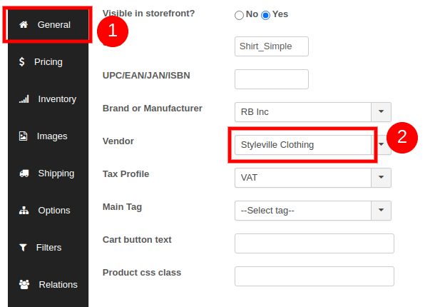
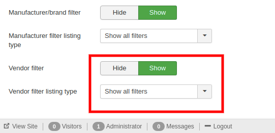
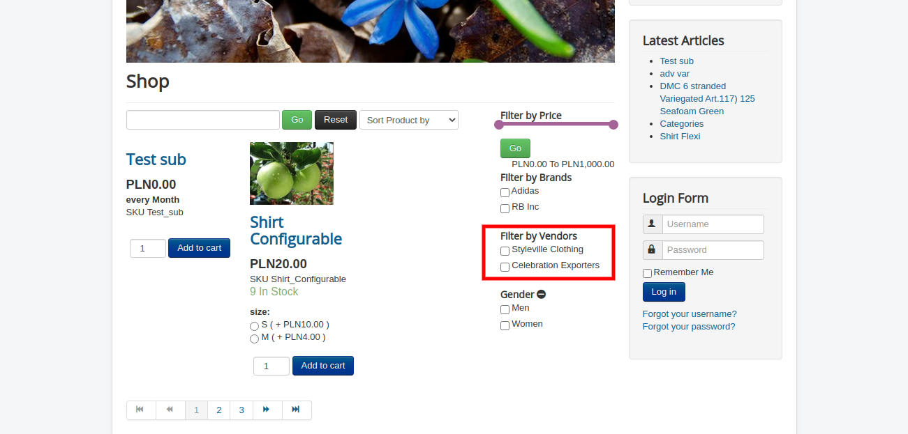

# Vendors

This is a database of vendors for products available in J2Store.

There are many products available in J2Store for customers. If the customers want to purchase the desired products, vendors must be available to deliver the products to them. This vendor database facilitates the customers to choose the vendor of their choice. They are listed with complete details including their zone and country. So customers can easily manage to find out a vendor.

Though the vendor is available in the database, the same must be enabled to be listed for customer selection.

Vendors are listed with the following details:

## General Information 

* First Name
* Last Name
* User
* Address
* City
* Zip
* Phone and Mobile

## Company Information 

* Company
* Tax Number
* Country
* Zone

See the image below on adding a new vendor.

## Associating the vendor to products

Once created, you can associate the vendor to your products by navigating to J2Store-&gt;Catalog-&gt;Products-&gt; Your product-&gt; J2Store cart tab-&gt;General and choosing the appropriate vendor for the product.

* Post associating the Vendor to products, navigate to Menu manager-&gt; Your product menu-&gt;Item view options in category listings tab.
* Scroll down to the Filter section and enable the options as indicated below:

Users can now view the available vendors and filter products based on vendors on the storefront:

