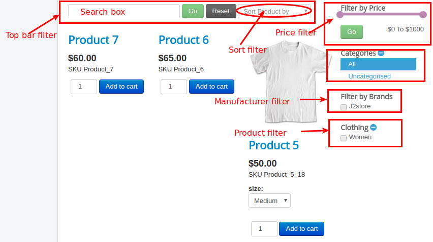

# Frequently Asked Questions

## Product Options not working or displaying option 

This problem may happen due to Jquery.Check your j2store basic settings tab in Joomla admin-&gt;J2store-&gt;setup-&gt;configuration.

You might have set **Load jQuery UI to only frontend**.

It should be always in Both frontend and backend. 



## Vat not appears in check out 

In Configuration - Tax, tax is set to be applied on the shipping address

In the tax profile, it is set to apply billing address.

For the tax rates to show up fine at the cart estimation and the checkout, the associated addresses at the Tax profile and the J2Store configuration tax tab should match.

## Donation plugin is empty.Why? 

The donation app adds a Donation option type. 

* So go to j2store -&gt; catalog -&gt;options. 
* Create a New option.
* Choose the option type as donation
* Save.

**Associating the Donation option to the product:**

* Open your product \(simple should work good\).
* Go to J2Store Cart - Options.
* Search for the donation option you just created.
* Add it and save.

## Multiple stores / different notification receiver depending on category 

J2Store is a B2C solution where you can maintain only one store. It does not support multi-store system. As a result, when an order is placed, all the store administrators will be notified.

If you just want the email notifications to be controlled and made dependent on the category,then a custom app could be developed that will send email for the party concerned.

## New Line Characters \(\r\n\) in Checkout form 

Go to Joomla admin - J2Store - Configuration - Checkout Layout. Click the Populate/re-set button and Save.

## Shipping Not Working 

Make sure about two things

1.Setting under J2Store &gt; Configuration &gt; Store &gt; Weight Unit.

2. Setting under Edit Product &gt; shipping tab

* Enable shipping.
* The configured shipping rates with shipping rates does has an entry with matching rate. For eg: In case the item has 829 grams, you have to configure a rate between 800 and 1000 and the estimate shipping lists the rate.

## Why the order is listed in the backend even didn’t make a payment? How to see the paid products? 

The purpose of the order status column is to differentiate between the new, paid, pending orders.If the order status is NEW, then no payment has been made.

If you do not like the word NEW, you can change it. Go to J2Store - Localisation - Order status.Edit NEW and change it to something like UNPAID

## Why the order is listed in the backend : 

When customer reaches the last step of Checkout, we have to save the data as the order. Because, when he clicks Place order, he will be redirected to PayPal. That also means we will lose the data if we did not save. So J2Store saves the order as NEW.

When a payment is successfully made, the order status will be set to CONFIRMED. So by looking at the order status, you can differentiate which orders are paid which are not.

There is a marketing opportunity as well. You can follow up with the unpaid customers and convert them.

## Grid layout not working/columns.Why? 

The issue seems to be the wrong sub-template. Open your product list layout menu. In Common options tab -&gt; set the sub-template as Bootstrap3. Save

This should solve the issue. If it is already set to Bootstrap 3, then try to set it as Default.

## Preview additional image after click 

copy "/components/com_j2store/templates/default/view\__images.php"

to

"/templates/YOUR_TEMPLATE/html/com_j2store/templates/default/view\_image.php"

Edit the file and remove the highlighted line fully.

## Remove Thumbnail image on the Joomla layout  

* Go to Extensions -&gt; Plugins -&gt; select the type content.
*  You can find Content\_J2Store plugin.
*  Open the plugin and goto the Item view tab. 
* Set Display image to No.

## How to display the tax information\(Incl. 19% tax\) with follow text have to be linked to a several page? 

**Step-1 Enable tax information to be displayed on product page**

Go to J2Store -&gt; Configuration - Tax settingsSet Display tax information below the prices \(in product pages\) to YES.See the screenshot below

 

It would display a text like this: \(Incl. XX% tax \)

This might be in English.

You can change this with a language override for below language constant.

Language constant is: J2STORE\__PRICE\__INCLUDING\_TAX

**Step-2 Creating language override**

Go to Extensions -&gt; Language\(s\) -&gt; select Overrides.

Choose your language\(For example, English\(en-GB-Administrator\)\) in filter section and click new on top left.

Add J2STORE\__PRICE\__INCLUDING\_TAX in Language constant text box.

In Text box, add Inkl %s MwSt \(add the link using html anchor tag\). For example,

Check For both locations.

Location should be administrator.

Save and close.

Here is a screenshot showing the language override

 

Here is how it looks in the front end

#### Remove image from orders and invoices while the image in cart remains based on the setting

You may create a template override for the below file:

Copy the file from/components/com\_j2store/views/myprofile/tmpl/orderitems.php

Paste into/templates/YOUR\_TEMPLATE/html/com\_j2store/myprofile/orderitems.php

Now edit the file and remove the following chunk of code,\(around line no 68\)

`params->get('show_thumb_cart', 1) && !empty($thumb_image)):?>`

#### **Logo doesn't show on PDF emailed to customer**

Sometimes you might have added the image of your company logo in your invoice template but it will not display.

**Solution:**

* Open the invoice template
* Choose the toggle editor
* Now change the image path
* Don't close the toggle editor when saving.

#### **Clicking on cart button redirecting to home and URL contains "&AMP"**

**SOLUTION:**

* It seems you have set NO to SEF URLs in joomla's global configuration.
* Please go to Joomla system &gt; Global Configuration
* In SEO settings, set YES to Search Engine Friendly URLs.
* Save.

#### Error: No shipping method was selected. Selection of a shipping method is mandatory

**SOLUTION:**

* It seems due to your cart settings in J2store &gt; configuration.
* You might have set YES to Prevent customer from checking out if shipping method was   not chosen option in J2store &gt; configuration &gt; cart.
* Please make sure before choosing YES to this option you must enable and configure shipping methods. Otherwise it will display the error as No shipping method was selected. Selection of a shipping method is mandatory and prevent customers from placing order.

#### Show/Hide Filters

Go to menu manager and open the menu which links to J2store &gt; Product List View. You can find the filter settings in Item view options in category listings.

Please refer the below image which shows the name of the filters.

 

**To hide Top bar filter completely:** Set HIDE to Top bar filters.

**To hide search box alone in Top bar filter:** Set HIDE to Search box.

**To hide sort filter alone in Top bar filter:** Set HIDE to Sort filter.

**To hide price filter in sidebar:** Set HIDE to price filter.

**To hide category filter in sidebar:** Set HIDE to Category filter.

**To hide Manufacturer filter\(Filter by Brands\):** Set HIDE to Manufacturer/Brand filter.

**To hide Product filter:** Set HIDE to Product filter.

**To hide all filters\(price filter, category filter, manufacturer filter, product filter\):** Set HIDE to Sidebar filters. You can change the positon of sidebar filter by changing the position of sidebar filters to Right and Left.

#### **Re-order checkout fields**

Go to J2Store &gt; Configuration &gt; Checkout Layout where you can find the fields for both checkout billing address layout and checkout shipping address layout.

The fields are enclosed with square bracket. For example, \[first\_name\]

You can re-locate the field to anywhere in the layout and you can also add the custom field there.

#### \[WHY\] payment options are not showing at checkout payment method step

Please go to J2Store -&gt; Set up - payment methodsOpen the payment methods you are using.And make sure the Geozone field is set to All

And make sure your order total \(cart total \) is above zero. If it is zero, payment methods wont be necessary at the checkout.

#### How to allow customers to see only paid orders?

Go to J2Store -&gt; Configuration -&gt; Orders.

Choose the statuses and save.Now customers will only be able to see the orders that has the selected statuses.

For example, if you selected Confirmed status alone, then only orders that has the confirmed status will show up.

#### Can I combine the features of variable product along with the configurable product?

The variable product offers variant-specific parameters while the configurable product offers a parent-child relationship.

Variable product and configurable products work based on different workflow.

This makes it not possible to combine both the features.

