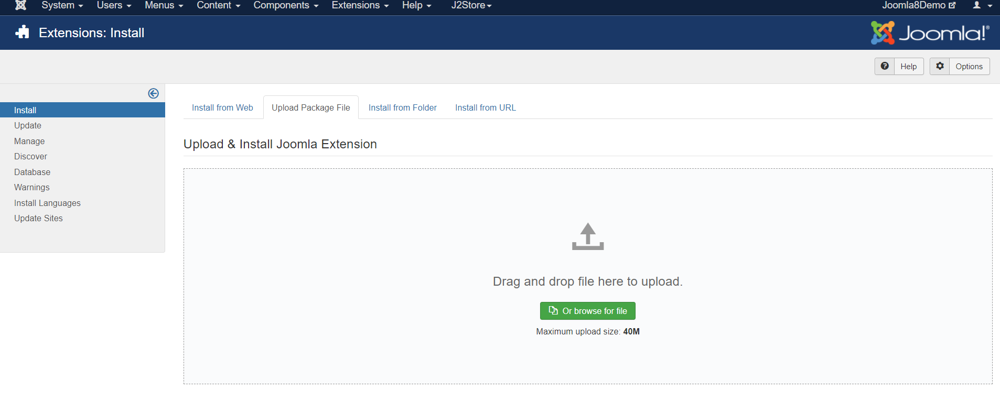
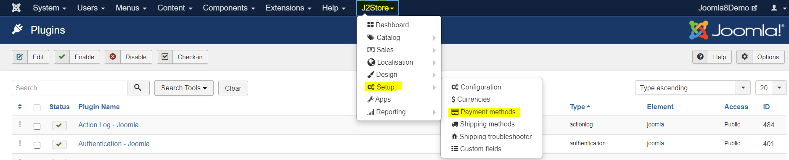
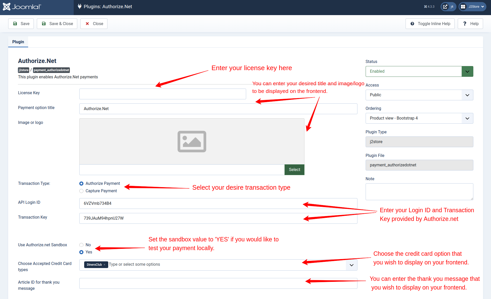
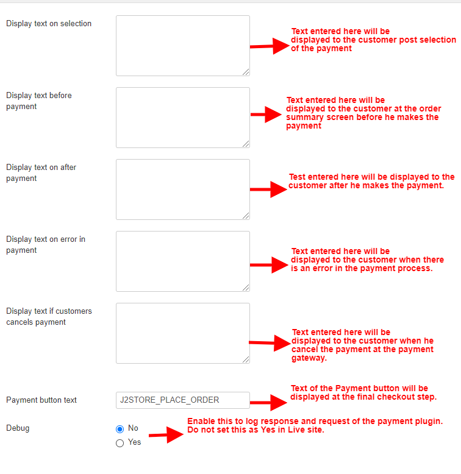

# Authorize.Net plugin

This Plugin enables you to receive payments via Authorize.Net Payment Gateway. Visit [click here](http://authorize.net/) to know more about the payment gateway.

## Requirements 

* PHP 5.2 or higher
* Joomla 2.5.x
* J2Store 1.0 or above

## Installation Instructions 

1. Use the Joomla installer to install the plugin.

2\. In the backend, go to J2Store->Setup-.Payment Methods->Authorize.net payment

3\. Enable the plugin.

4\. Enter the parameters (read the explanation about each parameter given below).

5\. Save and close it.

Now you can see the Authorize.net Payments as an option during the Checkout process.

## Parameters 

**License Key** Enter your license key here.\
\
**Payment option Title:**

Enter the payment title that you wish to display at the Frontend of your site.

**Image or Logo**

You can insert the image or the Logo that you wish to display at the Frontend of your site.

**Transaction Type**

You can find two types of transaction type in Authorize.net payment.

**Authorize Payment:**

The Authorize payment as the transaction type, would let you to approve the purchase manually and then process the payment.

**Capture Payment:**

You can capture the payment directly once the order is placed using the Capture payment in transaction method.

**API Login ID**

This is your Merchant Login Id given by the Authorize.net

**Authorize.net Transaction Key**

Transaction key provided by the authorize.net

**Use Authorize.net Sandbox**

Authorize.net offers a testing suite called Sandbox. Before going live, it is advised to test your store using the sandbox feature. Read more about Sandbox at Authorize.net.

NOTE: To receive payments (except during testing), you DONOT have to enable this.

\*\*IN LIVE SITE, THIS SHOULD BE SET TO NO. \*\*

Choose Accepted Credit Card Types:

You can select the desired credit card type that you wish to display at the Frontend of the site.

**Thanks Msg Joomla Article ID**

You can create a Joomla Article to say thanks to the users, who purchased in your online store. Enter the article ID here.

**Display text on selection**

The text entered here will be displayed to the customer at the order summary screen once he selects the payment. You can enter a language constant as a value here if you are using a multi-lingual site and then write a language override.&#x20;

**Display text before payment**

The text entered here will be displayed to the customer at the order summary screen before he makes the payment. You can enter a language constant as a value here if you are using a multi-lingual site and then write a language override.&#x20;

**Display text on after payment**

The text entered here will be displayed to the customer after he makes the payment. You can enter a language constant as a value here if you are using a multi-lingual site and then write a language override. Refer the Display text on selection parameter.

**Display text on error in payment**

The text entered here will be displayed to the customer when there is an error in the payment process.

You can enter a language constant as a value here if you are using a multi-lingual site and then write a language override. Refer the Display text on selection parameter.

**Display text on cancel payment**

The text entered here will be displayed to the customer when he cancels the payment at the gateway (NOT in your site).

You can enter a language constant as a value here if you are using a multi-lingual site and then write a language override. Refer the Display text on selection parameter.

**Payment Button Text**

The text of the payment button. The button will be displayed at the final checkout step.

**Debug:**

Enable this to log the responses and request of the payment plugin. Do not set this in live site.

Still have questions? You can post in our support forum: [click here](http://j2store.org/forum/index.html)

Thank you for using our extension.

\[HOW TO]Solve “Error processing payment Invalid Order This transaction cannot be accepted.” It seems to be using of expired transaction key.

**To regenerate the transaction key :**

1. Log into your Merchant Interface at [click here](https://account.authorize.net/)
2. Click Account from the main toolbar.
3. Click Settings in the main left-side menu.
4. Click API Credentials & Keys.
5. Enter your Secret Answer (the answer to your Secret Question configured at account setup).
6. Select New Transaction Key.
7. To disable the old Transaction Key, click the check box labeled Disable Old Transaction Key Immediately.
