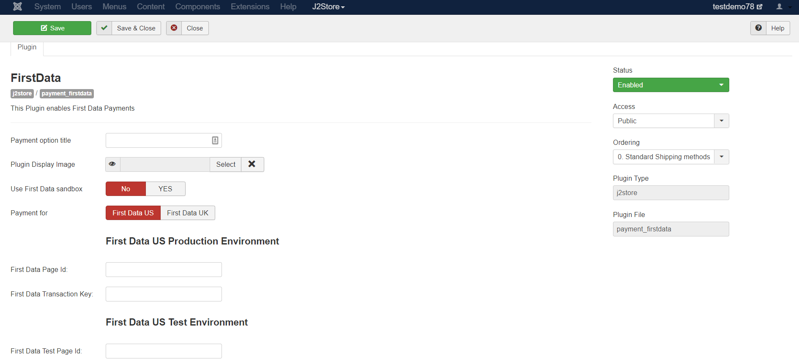
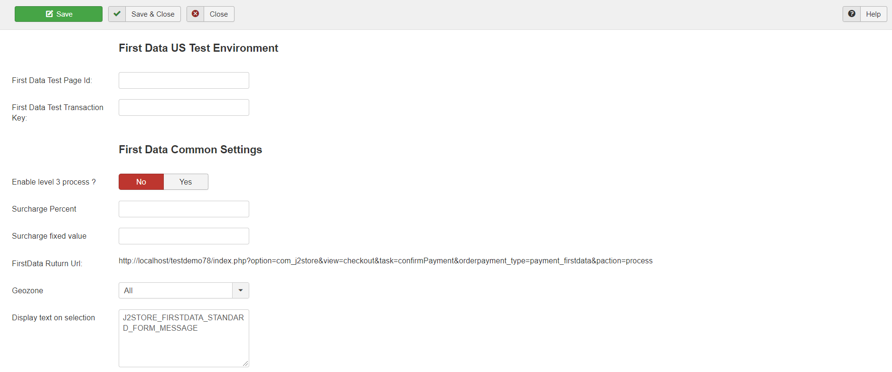
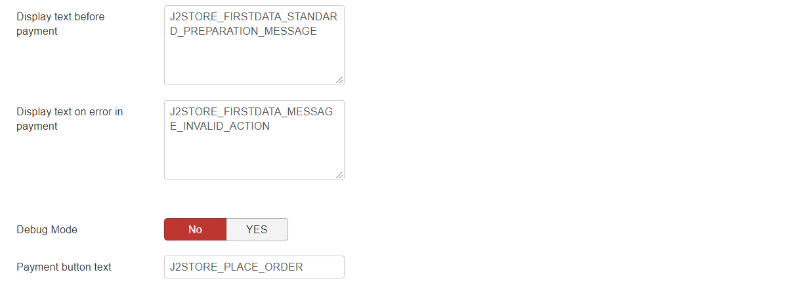

# First Data Plugin

The plugin integrates First Data Global Gateway e4℠ Hosted Payment Pages with J2Store.

## Requirements

1. PHP version 5.4 or higher
2. Joomla 3.x and above
3. J2Store 3.2.7 +

## Installation 

1. Download First Data payment plugin package from our site’s extensions section and install it using Joomla installer.
2. After installing plugin, go to J2Store &gt; Setup &gt; Payment methods and enable First Data

   for J2Store.

3. Once enabled, open / edit the plugin and configure the basic settings of the app.

## Configuration 

**Payment option title:** You may enter the title of the payment method you wish to display at the frontend in checkout here. If left blank, the default payment text will be displayed.

**Plugin Display Image:** You may consider adding an image for the payment method to be listed in the checkout page next to the payment method in frontend.

**Use First Data Sandbox:** The option allows you to test the First Data gateway using the First Data server instead of the live one. Use this option to test the plugin if you do not have a First Data account yet.

**Select the payment type of First Data plugin:** You may either select the FirstData US or FirstData UK here.

**First Data Page ID:** Please enter the First Data page ID associated with your First Data account.

**First Data Transaction Key:** Please enter the First Data transaction key associated with your First Data account.

**First Data Test page ID:** Please enter the First Data page ID associated with your First Data account.

**First Data Test Transaction Key:** Please enter the First Data transaction key associated with your First Data account.

**Enable level 3 process:** If you want to enable level 3 process, then set it to as Yes

**Surcharge Percent:** You can specify a percentage here. The Surcharge will be calculated based on the percentage of total order and the cost will be added to the order.

**Surcharge Fixed value:** You can specify a value here. The fixed value will be added to the order total

**FirstData Return URL:** Please copy the URL mentioned here and copy it in your FirstData return URL field.

**Geozone:** You can restrict showing this payment method only to the customers who belong to the selected geozone. Choose All in order to display this payment option to all customers.

**Display Text on Selection:** The text entered here will be displayed when customer selects this payment method. You can enter a language constant as a value here if you are using a multi-lingual site and then write a language override. Refer the tips below.

**Tip - ONLY FOR MULTI-LINGUAL SITES**

For example, enter a language constant:

J2STORE\__TEXT\__TO\__DISPLAY\__ON\_SELECTION

Now you can go to Joomla admin-&gt; Language Manager-&gt;Overrides and create overrides for the language constant in all your languages.

**Display Text before Payment:** The text entered here will be displayed to the customer at the order summary screen before he makes the payment. You can enter a language constant as a value here if you are using a multi-lingual site and then write a language override. Refer the Display text on selection parameter.

**Display Text on Error in Payment:** The text entered here will be displayed to the customer when there is an error in the payment process. You can enter a language constant as a value here if you are using a multi-lingual site and then write a language override. Refer the Display text on selection parameter.

**DEBUG :** This option is chosen in order to enable or disable the display of log file. This should be in disable for live sites.

**Payment Button Text:** The text of the payment button. The button will be displayed at the final checkout step.

Thus, once you have mentioned the necessary details for the above parameters, you are ready to receive payments via Paymate on your store.

 

