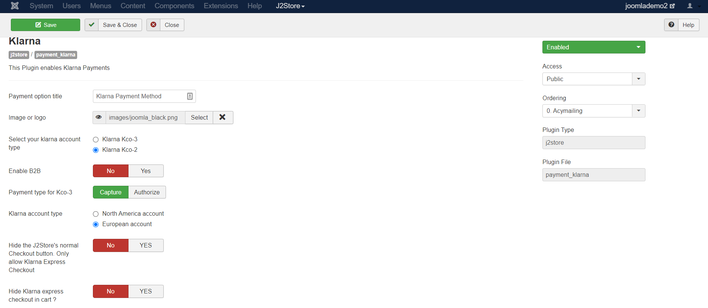

# Klarna Payment Plugin

The plugin integrates the Klarna checkout with J2Store joomla shopping cart. The Klarna checkout is the newest offering by the Klarna gateway.

Klarna Checkout is available in Sweden, Norway, Finland and Germany at the moment. To get started with Klarna Checkout you will need a separate EID and Shared secret. **Your credentials from using Klarna Invoice/Account will NOT work**.

So make sure that you have obtained the correct EID and Shared Secret from Klarna and enter them in the plugin params.&#x20;

## Requirements

1. PHP version 5.4 or higher
2. Joomla 3.x and above
3. J2Store 3.2.7 +

## Installation 

1. Download Klarna payment plugin package from our site’s extensions section and install it using Joomla installer.
2. After installing plugin, go to J2Store > Setup > Payment methods and enable Klarna for J2Store.
3. Once enabled, open / edit the plugin and configure the basic settings of the app.

## Configuration 

**Payment option title:** You may enter the title of the payment method you wish to display at the frontend in checkout here. If left blank, the default payment text will be displayed.

**Image or logo:** You may consider adding an image for the payment method to be listed in the checkout page next to the payment method in frontend.

**Select your Klarna Account Type:** You may select the account type from here as either KCO-2 or KCO-3.

**Enable B2B:** If you wish the company to pay then enable it as Yes, but then please ensure that the option B2B is enabled only post the same is enabled in your Klrana account

**Payment type for KC03:** You may select the Authorize option if you&#x20;

**Klarna account type:** When you set the mode as Authorize, the orders would be marked as Acknowledged in Klarna dashboard.

**Hide the J2Store's normal checkout button. Only allow Klarna Express checkout:** Setting this to Yes will disable J2Store's checkout process. If you do not charge shipping or do not need any additional information from customer, then you can disabled J2Store checkout.                                                              On the other hand if you do wish to charge for shipping or any other fee then please set it as No.

**Hide Klarna Express checkout in cart? :** This option is used to hide Klarna express checkout option in the cart page at the store frontend.

**Force Shipping Selection:** If set this to Yes, then the user cannot place order or checkout with Klarna without choosing a shipping method.

**List Klarna Express Checkout as one of the payment options in Normal checkout steps (payment selection step):** If you wish to display the payment options in the checkout then you may set it as Yes. And If set as No then the payment method will not be displayed in checkout.

**Klarna Live Merchant Id(KCO-2) / Api username (KCO-3):** Please enter Klrana Live Merchant ID(KCO-2) / API username (KCO-3) associated with your Klarna account.

**Klarna Live shared Secret(KCO-2) / API(KCO-3):**  Please enter Klrana Live shared secret ID(KCO-2) / API username (KCO-3) associated with your Klarna account.

**Use Klarna Sandbox:** This option allows you to test the Klarna gateway using Klarna server instead of the live one. Use this option to test the plugin, if you do not have an Klarna account yet. If the option is set to Yes then please enter the Klarna Test Merchant ID and Secret key as mentioned below.

**Klarna Test Merchant ID(KC0-2) / API username(KCO-3):**  Please enter Klrana Test Merchant ID(KCO-2) / API username (KCO-3) associated with your Klarna account.

**Klarna Test shared Secret(KCO-2) / API(KCO-3):**  Please enter Klrana Test shared secret ID(KCO-2) / API username (KCO-3) associated with your Klarna account.

**Language:** You may consider selecting the language similar to your J2Store language here.

**Article ID for Thank you message:** This article is placed after payment is processed. It can include anything (including plugins) and to the very least tell the customer what to do next.

Error Payment Article: You may enter the error page article ID here.

**Geozone:** You can restrict showing this payment method only to the customers who belong to the selected geozone. Choose All in order to display this payment option to all customers.

**Display Text on Selection:** The text entered here will be displayed when customer selects this payment method. You can enter a language constant as a value here if you are using a multi-lingual site and then write a language override. Refer the tips below.

**Tip - ONLY FOR MULTI-LINGUAL SITES**

For example, enter a language constant:

J2STORE\__TEXT\__TO\__DISPLAY\__ON\_SELECTION

Now you can go to Joomla admin-> Language Manager->Overrides and create overrides for the language constant in all your languages.

**Display Text before Payment:** The text entered here will be displayed to the customer at the order summary screen before he makes the payment. You can enter a language constant as a value here if you are using a multi-lingual site and then write a language override. Refer the Display text on selection parameter.

**Display Text after Payment/Order:** The text entered here will be displayed to the customer after he makes the payment. You can enter a language constant as a value here if you are using a multi-lingual site and then write a language override. Refer the Display text on selection parameter.

**Display Text on Error in Payment:** The text entered here will be displayed to the customer when there is an error in the payment process. You can enter a language constant as a value here if you are using a multi-lingual site and then write a language override. Refer the Display text on selection parameter.

**Display Text on Cancel Payment:** The text entered here will be displayed to the customer when he cancels the payment at the gateway (NOT in your site). You can enter a language constant as a value here if you are using a multi-lingual site and then write a language override. Refer the Display text on selection parameter.

**Payment Button Text:** The text of the payment button. The button will be displayed at the final checkout step.

**DEBUG :** This option is chosen in order to enable or disable the display of log file. This should be in disable for live sites.

Thus, once you have mentioned the necessary details for the above parameters, you are ready to receive payments via Klarna on your store.

