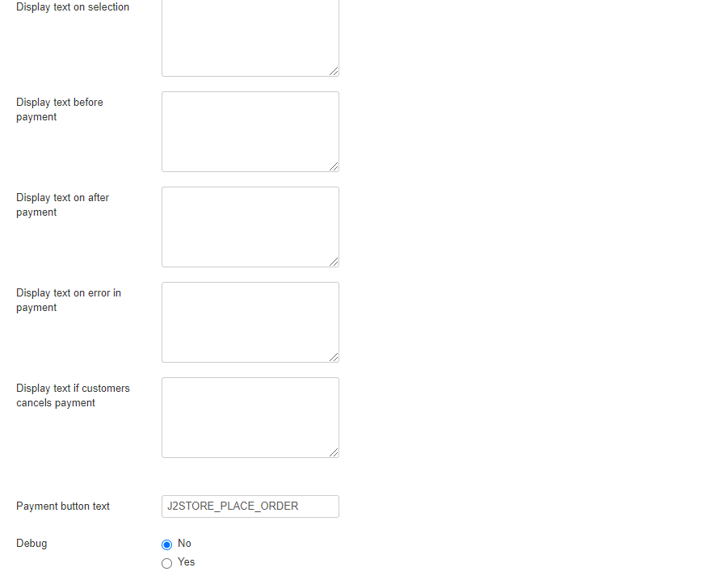

# Paymate

This plugin integrates J2Store's Joomla eCommerce solution with PayMate payment gateway, allows customers to make purchase securely from your website.

## Requirements

1. PHP version 5.4 or higher
2. Joomla 3.x and above
3. J2Store 3.2.7 +

## Installation 

1. Download Paymate payment plugin package from our site’s extensions section and install it using Joomla installer.
2.  After installing plugin, go to J2Store > Setup > Payment methods and enable Paymate&#x20;

    for J2Store.
3. Once enabled, open / edit the plugin and configure the basic settings of the app.

## Configuration 

**Payment option title:** You may enter the title of the payment method you wish to display at the frontend in checkout here. If left blank, the default payment text will be displayed.

**Image or logo:** You may consider adding an image for the payment method to be listed in the checkout page next to the payment method in frontend.

**Username:** You may enter the username of your Paymate payment account here.

**Sandbox/Test Mode:** This option allows you to test the Paymate gateway using the paymate sandbox server instead of the live one. Use this option to test the plugin if you do not have a Paymate account yet.

**J2Store-PaymentSandbox**_**\_**_**Use:** You may enter the test account username with your Paymate payment account here.

**Article ID for Thank you message:** This article is placed after payment is processed. It can include anything (including plugins) and to the very least tell the customer what to do next.

**Geozone:** You can restrict showing this payment method only to the customers who belong to the selected geozone. Choose All in order to display this payment option to all customers.

.png>)

**Display Text on Selection:** The text entered here will be displayed when customer selects this payment method. You can enter a language constant as a value here if you are using a multi-lingual site and then write a language override. Refer the tips below.

**Tip - ONLY FOR MULTI-LINGUAL SITES**

For example, enter a language constant:

J2STORE\__TEXT\__TO\__DISPLAY\__ON\_SELECTION

Now you can go to Joomla admin-> Language Manager->Overrides and create overrides for the language constant in all your languages.

**Display Text before Payment:** The text entered here will be displayed to the customer at the order summary screen before he makes the payment. You can enter a language constant as a value here if you are using a multi-lingual site and then write a language override. Refer the Display text on selection parameter.

**Display Text after Payment:** The text entered here will be displayed to the customer after he makes the payment. You can enter a language constant as a value here if you are using a multi-lingual site and then write a language override. Refer the Display text on selection parameter.

**Display Text on Error in Payment:** The text entered here will be displayed to the customer when there is an error in the payment process. You can enter a language constant as a value here if you are using a multi-lingual site and then write a language override. Refer the Display text on selection parameter.

**Display Text on Cancel Payment:** The text entered here will be displayed to the customer when he cancels the payment at the gateway (NOT in your site). You can enter a language constant as a value here if you are using a multi-lingual site and then write a language override. Refer the Display text on selection parameter.

**Payment Button Text:** The text of the payment button. The button will be displayed at the final checkout step.

**DEBUG :** This option is chosen in order to enable or disable the display of log file. This should be in disable for live sites.

Thus, once you have mentioned the necessary details for the above parameters, you are ready to receive payments via Paymate on your store.

****

