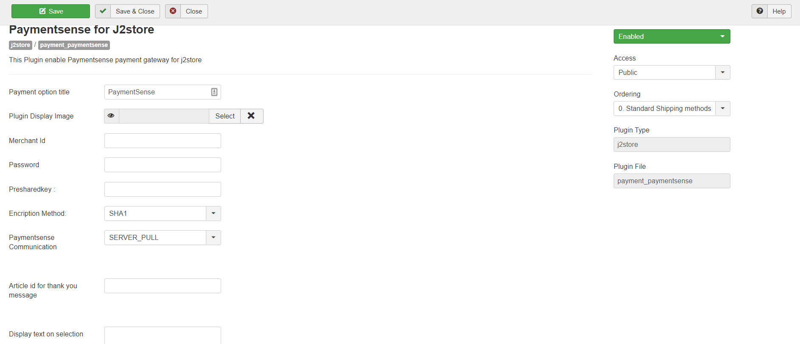
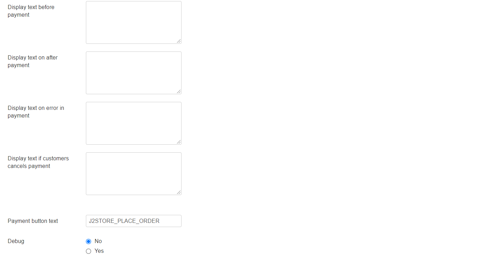

# Payment Sense

## Requirements

1. PHP version 5.4 or higher
2. Joomla 3.x and above
3. J2Store 3.2.7 +

## Installation 

1. Download PaymentSense plugin package from our site’s extensions section and install it using Joomla installer.
2.  After installing plugin, go to J2Store > Setup > Payment methods and enable PaymentSense&#x20;

    for J2Store.
3. Once enabled, open / edit the plugin and configure the basic settings of the app.

## Configuration 

**Payment option title:** You may enter the title of the payment method you wish to display at the frontend in checkout here. If left blank, the default payment text will be displayed.

**Plugin Display Image:** You may consider adding an image for the payment method to be listed in the checkout page next to the payment method in frontend.

**Merchant ID:** Please enter the Merchant ID associated with your Payamentsense account

**Password:** Please enter the password associated with your Payamentsense account

**PreShareKey:** Please enter the PreShareKey associated with your Payamentsense account

**Encription Method:** Choose your Encription Method here from the available options.

**PaymentSense Communication:** You may select the payment response method here from the provided options.

**Article ID for Thankyou page:** This article is displayed after the payment is processed. It can include anything (including the plugins) and should at the very least tell your customer what to do next.

**Display Text on Selection:** The text entered here will be displayed when customer selects this payment method. You can enter a language constant as a value here if you are using a multi-lingual site and then write a language override. Refer the tips below.

**Tip - ONLY FOR MULTI-LINGUAL SITES**

For example, enter a language constant:

J2STORE\__TEXT\__TO\__DISPLAY\__ON\_SELECTION

Now you can go to Joomla admin-> Language Manager->Overrides and create overrides for the language constant in all your languages.

**Display Text before Payment:** The text entered here will be displayed to the customer at the order summary screen before he makes the payment. You can enter a language constant as a value here if you are using a multi-lingual site and then write a language override. Refer the Display text on selection parameter.

**Display Text after Payment:** The text entered here will be displayed to the customer after he makes the payment. You can enter a language constant as a value here if you are using a multi-lingual site and then write a language override. Refer the Display text on selection parameter.

**Display Text on Error in Payment:** The text entered here will be displayed to the customer when there is an error in the payment process. You can enter a language constant as a value here if you are using a multi-lingual site and then write a language override. Refer the Display text on selection parameter.

**Display Text if customer Cancels Payment:** The text entered here will be displayed to the customer when he cancels the payment at the gateway (NOT in your site). You can enter a language constant as a value here if you are using a multi-lingual site and then write a language override. Refer the Display text on selection parameter.

**Payment Button Text:** The text of the payment button. The button will be displayed at the final checkout step.

**DEBUG :** This option is chosen in order to enable or disable the display of log file. This should be in disable for live sites.

Thus, once you have mentioned the necessary details for the above parameters, you are ready to receive payments via Paymentsense on your store.

