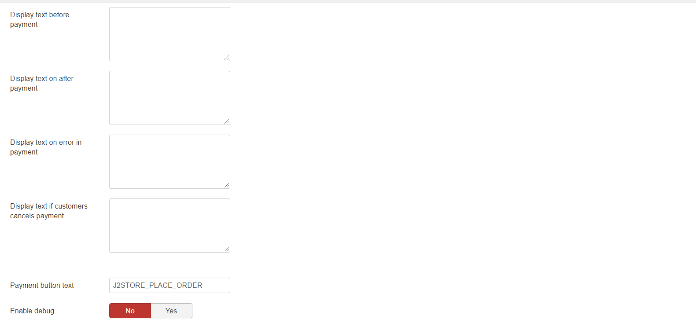

# PayUMoney plugin

It accepts payments via debit card, credit card and Net Banking with PayU Money, a leading payment gateway in India.

The plugin integrates with PayU money and ensures a smooth transaction.

With J2Store, you can create an online store in less than 10 minutes and start selling your goods and payments. PayU Money offers almost immediate approval for accepting payments via online store.

Requirements

1. PHP version 5.4 or higher
2. Joomla 3.x and above
3. J2Store 3.2.7 +

## Installation 

1. Download PayU Money payment plugin package from our site’s extensions section and install it using Joomla installer.
2. After installing plugin, go to J2Store &gt; Setup &gt; Payment methods and enable PayU Money 

   for J2Store.

3. Once enabled, open / edit the plugin and configure the basic settings of the app.

## Configuration 

**Payment option title:** You may enter the title of the payment method you wish to display at the frontend in checkout here. If left blank, the default payment text will be displayed.

**Plugin Display Image:** You may consider adding an image for the payment method to be listed in the checkout page next to the payment method in frontend.

**Merchant key provided by PayUMoney:** Enter your merchant key associated with your PayU Money account.

**Merchant Salt key provided by PayUMoney:** Enter your salt key associated with your PayU Money account.

**Enable Test Environment:** If you wish to test the PayU Money payment plugin then you can set this option which will change it to test mode instead of live mode.

**Test Merchant Key:** Enter the Merchant key associated with your PayU Money account.

**Test Salt Key:** Enter the Salt key associated with your PayU Money account.

**Thank you Message:** You can create a Joomla Article to say thanks to the users, who purchased in your online store. Enter the article ID here.

**Display Text on Selection:** The text entered here will be displayed when customer selects this payment method. You can enter a language constant as a value here if you are using a multi-lingual site and then write a language override. Refer the tips below.

**Tip - ONLY FOR MULTI-LINGUAL SITES**

For example, enter a language constant:

J2STORE\__TEXT\__TO\__DISPLAY\__ON\_SELECTION

Now you can go to Joomla admin-&gt; Language Manager-&gt;Overrides and create overrides for the language constant in all your languages.

**Display Text before Payment:** The text entered here will be displayed to the customer at the order summary screen before he makes the payment. You can enter a language constant as a value here if you are using a multi-lingual site and then write a language override. Refer the Display text on selection parameter.

**Display Text after Payment:** The text entered here will be displayed to the customer after he makes the payment. You can enter a language constant as a value here if you are using a multi-lingual site and then write a language override. Refer the Display text on selection parameter.

**Display Text on Error in Payment:** The text entered here will be displayed to the customer when there is an error in the payment process. You can enter a language constant as a value here if you are using a multi-lingual site and then write a language override. Refer the Display text on selection parameter.

**Display Text if customer cancels Payment:** The text entered here will be displayed to the customer when he cancels the payment at the gateway \(NOT in your site\). You can enter a language constant as a value here if you are using a multi-lingual site and then write a language override. Refer the Display text on selection parameter.

**Payment Button Text:** The text of the payment button. The button will be displayed at the final checkout step.

**DEBUG :** This option is chosen in order to enable or disable the display of log file. This should be in disable for live sites.

Thus, once you have mentioned the necessary details for the above parameters, you are ready to receive payments via PayU Money on your store.

  

