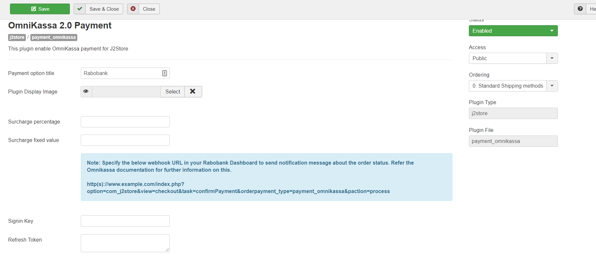
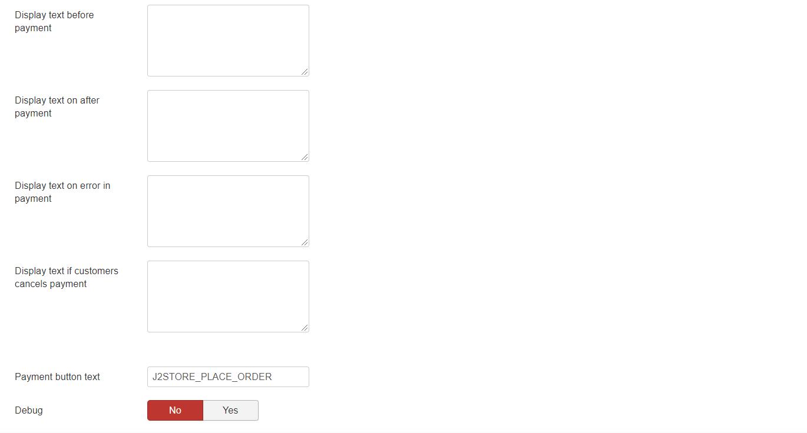

# Rabobank Omnikassa

This plugin allows you to integrate J2Store with Rabobank's Omnikassa payment gateway.

Rabo OmniKassa is popular payment service provided by the Rabobank, one of the trusted and widely used banks in Netherlands. It allows you to accept dutch and international payment methods in your online store.

It is the secure and easy way to offer a wide range of payment options to  your customers with a single contract. The plugin offers following payment options provided by Rabo Omnikassa:

1. iDEAL
2. Visa, Mastercard, Maestro
3. V Pay
4. MiniTix
5. Bancontact, Mistercash and more...

## Key Features:

* Accept all the payment methods your store needs with one contract.
* Safe and Reliable, security maintained and provided by Rabobank
* Low costs: iDEAL is 35 cents per transaction and MisterCash just 1.5% per transaction
* Fast access to your money, in your bank account within two days
* Easily process refunds via the Rabo OmniKassa dashboard
* With just one click easily export all transaction data for your bookkeeping
* Automatic order status updates in WooCommerce, even when the customer closes the page too soon
* No signup costs required to get started with Rabo OmniKassa

## System Requirements 

* PHP 5.4 or greater
* Joomla 3.x
* J2Store 3.2.x or greater

## Installation Instructions

* Use the Joomla installer to install the plugin.
* In the backend, go to J2store Dashboard -> Payment methods and enable plugin.
* Open the plugin and enter the parameters (read the explanation about each parameter given below)
* Save and close it.

## To get Started with Rabo Omnikassa:

If you are yet to sign up with Rabo Omnikassa already, you should contact Rabo Bank to open a Business bank account and then apply for the payment gateway service.\
Once approved, you will get the Merchant ID and the Key.

## **Configuration:**

**Payment option title** The value entered here will be used as the title for this payment method. Customer will see this value when he checks out.

**Plugin Display Image** This image will be displayed while payment options are listed in the checkout page.

**Surcharge Percentage:** You can specify a percentage here.  Surcharge will be calculated based on the percentage of the total order and the cost will be added to the order.

**Surcharge fixed value:** You can specify a value here. The fixed value will be added to the total.

**Signin Key:** Enter your Signin Key associated with your Rabobank Omnikassa payment account

**Refresh Token:** Enter your refresh Token associated with your Rabobank Omnikassa payment account

**Use Sandbox/Testmode:** The option allows you to test the OmniKassa  gateway using the test Omnikassa server instead of live one.

**Sandbox Signin Key:** Enter your Test Signin Key associated with your Rabobank Omnikassa payment account

**Sandbox Refresh Token**: Enter your test Refresh Token associated with your Rabobank Omnikassa payment account

**Payments Methods:** Select the payment method associated with your Merchant account.

**Payment Method Force:**

> Choose your payment force method:

* **Force Once:** The indicated payment is only enforced on the first transaction. If it fails the consumer can still choose another payment method.
* **Force Always:** When this option is chosen, the consumer cannot choose another payment method.

**Payment from language:** You can set your payment form language here.

**Article Id for Thank you message** You can create a Joomla Article to say thanks to the users, who purchased in your online store. Enter the article ID here.

**Display text on selection** The text entered here will be displayed when customer selects this payment method. You can enter a language constant as a value here if you are using a multi-lingual site and then write a language override. For example, enter a language constant:

J2STORE_TEXT_TO_DISPLAY_ON\_SELECTION.

Now you can go to Joomla admin-> Language Manager->Overrides and create overrides for the language constant in all your languages.

**Display text before payment** The text entered here will be displayed to the customer at the order summary screen before he makes the payment. You can enter a language constant as a value here if you are using a multi-lingual site and then write a language override. Refer the Display text on selection parameter.

**Display text on after payment** The text entered here will be displayed when customer completes the payment. You can enter a language constant as a value here if you are using a multi-lingual site and then write a language override. Refer the Display text on selection parameter.

**Display text on error in payment** The text entered here will be displayed to the customer when there is an error in the payment process. You can enter a language constant as a value here if you are using a multi-lingual site and then write a language override. Refer the Display text on selection parameter.

**Display text if customers cancels payment** The text entered here will be displayed to the customer when he cancels the payment at the gateway (NOT in your site). You can enter a language constant as a value here if you are using a multi-lingual site and then write a language override. Refer the Display text on selection parameter.

**Payment button text** Text entered here will be added as the name of the payment button. You can enter a language constant as a value here if you are using a multi-lingual site and then write a language override.

**Debug** Choose YES to enable the debug mode. If you set this to yes, then debug messages will be logged and saved in the cache folder in your Joomla root directory. DO NOT select YES in the live site.

\

\
\
