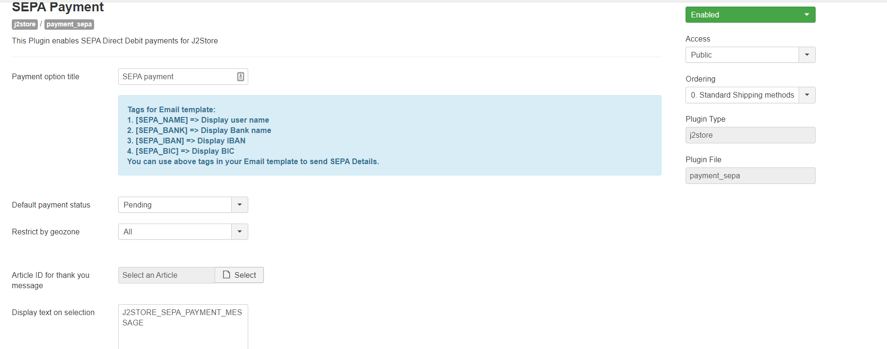
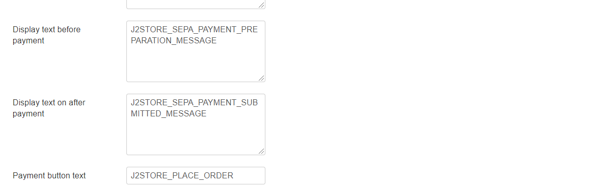

# Sepa Payment

This plugin enables SEPA payment for J2Store. You can collect the account details from the customer and those information are displayed in the Orders. Then you can manually process the payments.

## Requirements

1. PHP version 5.4 or higher
2. Joomla 3.x and above
3. J2Store 3.2.7 +

## Installation 

1. Download SEPA payment plugin package from our site’s extensions section and install it using Joomla installer.
2.  After installing plugin, go to J2Store > Setup > Payment methods and enable SEPA&#x20;

    for J2Store.
3. Once enabled, open / edit the plugin and configure the basic settings of the app.

## Configuration 

**Payment option title:** You may enter the title of the payment method you wish to display at the frontend in checkout here. If left blank, the default payment text will be displayed.

**Default payment status:** You can choose the payment status that you wish to here.

**Restrict by Geozone:** You can restrict showing this payment method only to the customers who belong to the selected geozone. Choose All in order to display this payment option to all customers.

**Article ID for Thankyou page:** This article is displayed after the payment is processed. It can include anything (including the plugins) and should at the very least tell your customer what to do next.

**Display Text on Selection:** The text entered here will be displayed when customer selects this payment method. You can ~~enter~~ a language constant as a value here if you are using a multi-lingual site and then write a language override. Refer the tips below.

**Tip - ONLY FOR MULTI-LINGUAL SITES**

For example, enter a language constant:

J2STORE\__TEXT\__TO\__DISPLAY\__ON\_SELECTION

Now you can go to Joomla admin-> Language Manager->Overrides and create overrides for the language constant in all your languages.

**Display Text before Payment:** The text entered here will be displayed to the customer at the order summary screen before he makes the payment. You can enter a language constant as a value here if you are using a multi-lingual site and then write a language override. Refer the Display text on selection parameter.

**Display Text after Payment:** The text entered here will be displayed to the customer after he makes the payment. You can enter a language constant as a value here if you are using a multi-lingual site and then write a language override. Refer the Display text on selection parameter.

**Payment Button Text:** The default text being Place order, the name of the payment button has to be specified here.

