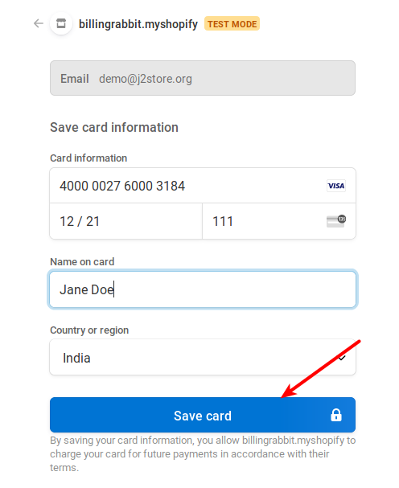
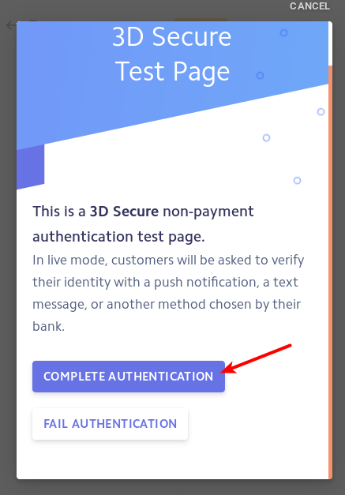
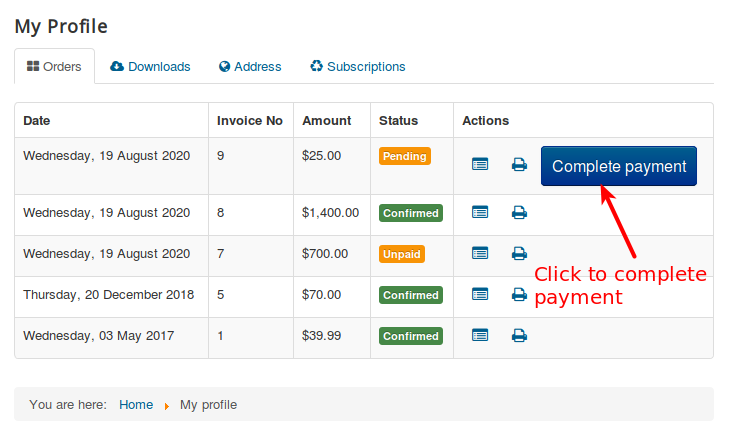
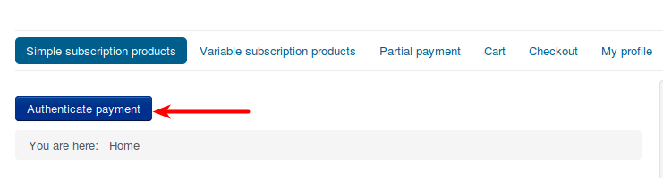
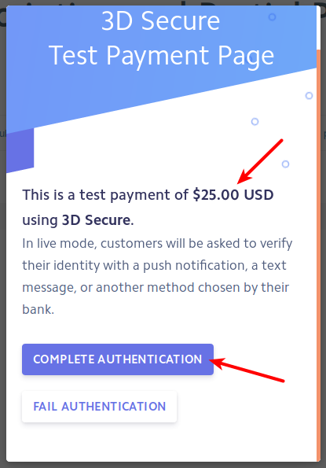
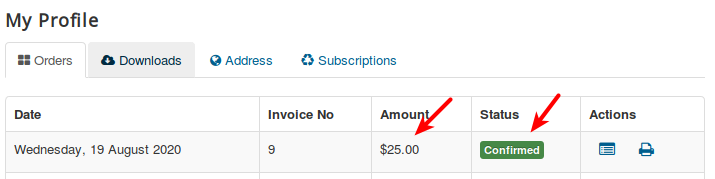

# Stripe

This plugin integrates the Stripe Payment gateway with J2Store. It works and compatible with the latest Stripe API : 2014-01-31 \(latest\)

> NOTE: If you are using Stripe’s in built form, Please make sure that you have enabled SSL. If not, this might cause issues in the Stripe’s Javasript from loading on the site, thus blocking the checkout process.

With the purchase of Stripe integration, you would get access to two packages namely, **Stripe direct\(The default checkout\) and Stirpe checkout\(Hosted\).**

You could download both the packages from the My downloads section of the [J2Store site.](https://www.j2store.org/)

## Stripe direct Vs Stripe Hosted checkout 

**Stripe direct** This is the standard version of Stripe plugin that most of you might have used until now. This integration offers three modes: 1. Normal form 2. Pop-up form 3. In-built form\(Recommended\)  
 Among the above three modes, only the In-built form supports SCA regulations that are in effect since September, 2019. Following is a guide on how to install and configure the Stripe Direct payment plugin.

**Stripe Hosted checkout**

The Hosted checkout transactions would take place in the Stripe payment window. So, you need not worry about SCA compliance since the transactions are handled by Stripe itself. Hence this integration is ideal for Merchants who wish to support both Normal and 3-D secure card payments.

## Connecting Stripe direct with your store 

You could configure the Stripe direct payments on your site by following the below steps:

1. Retrieving the API keys
2. Installation
3. Connecting your store with Stripe

### How to retrieve your Stripe API keys 

To configure the Stripe Hosted checkout, you might want to retrieve the API keys\(Both Test and Live keys\).

Click [here](https://stripe.com/docs/keys) to know how to retrieve the API keys.

## Installation of Stripe Direct 

Use the Joomla extensions installer to install the plugin.

**Payments supported by J2Store Stripe direct integration**

J2Store’s Stripe integration supports the following types of payments:

* Credit card payment
* Cryptocurrency

**Payments not supported by Stripe direct:**

J2Store’s Stripe integration doesn’t support the following payments:

* Paypal
* SEPA
* SOFORT

### Connecting your store with Stripe 

Go to Joomla admin → Plugin Manager and open the Stripe plugin. Or you could access the plugin through J2Store-&gt;Setup-&gt;Payment methods-&gt;Stripe.

The plugin has following options: 

**Payment option title** The value entered here will be used as the title for this payment method. Customer will see this value when he checks out. If you have a multi-lingual site and wish to translate the title in other languages of your site, you could mention a custom language constant like **J2STORE\_**_**PAYMENT\_**_**METHOD\_**_**STRIPE\_**_**TITLE** and create a [language override](https://docs.j2store.org/translation/language-overrides-in-joomla-with-examples-using-j2store/) to translate it into the other languages.

**Plugin Display Image** Image chosen here will be displayed when the payment options are listed in the checkout page

**Surcharge percentage** Enter the percentage here. Surcharge will be calculated based on the percentage of total order and the cost will be added to the order.

**Surcharge fixed value** Enter the fixed value here. The value entered will be added to the total order.

**Live Secret API Key:** Enter your live stripe account’s secret API key.

**Live Publishable Key:** Enter your live stripe publishable key.

 **Use Stripe in Test mode:** If you wish to test the stripe payment plugin then you can set this option which will change the stripe to test mode instead of live mode.

**Test Secret API Key:** Enter you test stripe account’s secret API key.

**Test Publishable Key:** Enter your test stripe account’s publishable API key.

**Charge mode:** Choose the required charge mood.

1. SAFE - captures the amount immediately.
2. AUTHORIZE: Charge issues an authorization and will need to be captured later.This has to be done manually.

**Credit card form display type :**

By choosing any of the listed option you select the payment form for stripe.

1. Normal Form -Displays the form in the payment select page
2. Popup Form - Displays the form in the confirm page
3. Stripe Inbuilt form - This is the default stripe payment form and this is the most recommended\(make sure SSL is enabled on your site\).

**Disable Zip code in Stripe inbuilt form** If you set this to YES, a field would be displayed asking for the Zip code of the users while they fill in their card details at the checkout. This option is applicable only if you enable in-built form as the Credit card form display type.

 **Enable payment intent\(SCA Complaints\) in Inbuilt form ?** If you set this option to YES and the Credit card form display type to In-built form, then the in-built form would support SCA regulations and you could collect payments from 3-D secure cards.

 **Force URL to use latest SSL/TLS version available in the server** Enabling this option will force the URL to use the latest SSl or TLS version when multiple versions are available in your server.

**Enable card holder name for stripe inbuilt form:** Setting this to yes will help to display a text box to enter the card holder name.

**Company or website name \(Default store name will be taken\) for Popup :** Enter company or website name. It will be displayed in the stripe pop up form page.

**Payment Description for Popup form:** Description text enter will be displayed in the popup form.

**Enable zip code in popup form ?** To display zip code in the pop-up form enable this option.

**Enable remember me feature:** If you wish to establish a remember me option then set this to yes. This will ease the payment process for customer by saving their card details preventing them from entering again and again.

 **Send customer address to Stripe** If you enable this the customer address will be sent to the stripe.

 **Enable Bitcoin:** If you wish to allow the customer to send payment via bitcoin then set this to yes.

 **Article ID for Thanks Msg:** You can create an article with a thank you or instructions or information to the customer and enter its ID here. This will be displayed to the customer when he returns to the site after making payment.

**Geozone:** You can restrict showing this payment method only to the customers who belong to the selected geozone. Choose All in order to display this payment option to all customers.

**Display Text on Selection** The text entered here will be displayed when customer selects this payment method.

You can enter a language constant as a value here if you are using a multi-lingual site and then write a language override. Refer the tips below.

**Tip - ONLY FOR MULTI-LINGUAL SITES**

For example, enter a language constant:

J2STORE\__TEXT\__TO\__DISPLAY\__ON\_SELECTION

Now you can go to Joomla admin-&gt; Language Manager-&gt;Overrides and create overrides for the language constant in all your languages.

**Display Text before Payment**

The text entered here will be displayed to the customer at the order summary screen before he makes the payment.

You can enter a language constant as a value here if you are using a multi-lingual site and then write a language override. Refer the Display text on selection parameter.

**Display Text after Payment/Order**

The text entered here will be displayed to the customer after he makes the payment.

You can enter a language constant as a value here if you are using a multi-lingual site and then write a language override. Refer the Display text on selection parameter.

**Display Text on Error in Payment**

The text entered here will be displayed to the customer when there is an error in the payment process.

You can enter a language constant as a value here if you are using a multi-lingual site and then write a language override. Refer the Display text on selection parameter.

**Display Text on Cancel Payment**

The text entered here will be displayed to the customer when he cancels the payment at the gateway \(NOT in your site\).

You can enter a language constant as a value here if you are using a multi-lingual site and then write a language override. Refer the Display text on selection parameter.

**Payment Button Text**

The text of the payment button. The button will be displayed at the final checkout step.

**DEBUG :**

This option is chosen in order to enable or disable the display of log file. This should be in disable for live sites.

Thus, once you have mentioned the necessary details for the above parameters, you are ready to receive payments via Stripe on your store.

## Stripe checkout\(Hosted\) 

As mentioned in the introduction, Stripe Checkout\(Hosted\) is compliant to SCA by default since the transactions are handled by Stripe itself. Also, you need not worry about the payment method layout being responsive since users would be redirected to Stripe for the transactions.

## Configuring the Stripe Hosted checkout in your site 

You could configure the Stripe Hosted payments on your site by following the below steps:

1. Retrieving the API keys
2. Installation
3. Connecting your store with Stripe

### Retrieving the API keys 

The same keys used for Stripe direct can also be used to connect your store to Stripe hosted checkout as well.

### Installation 

Use the Joomla extensions installer to install the plugin. Post installation, navigate to J2Store-&gt;Setup-&gt;Payment methods-&gt; Enable the Stripe checkout plugin and edit the plugin to connect it with Stripe.

### Connecting your store with Stripe Checkout 

Once the API keys are retrieved, and the plugin is installed, the next step is to connect the store with your Stripe account.

Stripe Hosted checkout uses almost the same parameters as the Stripe direct payment method described above, except for the **Create/Update Webhook** parameter

**Purpose of Webhooks on Stripe**

As mentioned above, with Stripe Hosted checkout, all the transactions occur in the Stripe window, so the merchant site has to be informed of the changes that occur with the transaction. Only then the corresponding orders can be updated on the merchant site. Webhooks are for this purpose. They are similar to IPN callbacks that are used as a communication between the Payment gateway and your ecommerce store.

**Update/ Create webhook** This option in the Stripe checkout wouldn’t have any values initially when you have just installed the plugin. However, after you enter the API keys in the plugin and save, a value would appear.

Once you entered the credentials and saved the plugin, an **Update webhook** button would show up as follows:

 

**Where to find your site’s webhook in Stripe dashboard** Once you connect your store with Stripe by entering the API keys, there would be a webhook created in the Stripe dashboard. For the transactions to be updated in your J2Store orders, you will have to ensure that a webhook is created on your stripe dashboard.

To check this, navigate to Stripe dashboard-&gt;Developers-&gt;Webhooks.

In the above screenshot, a webhook is created once for the corresponding store as indicated. This means that the transactions would be successfully communicated to the store that is connected to this account.

**When should you update your webhook?** If you have re-generated your Stripe API keys, then it means that your webhook should be updated. So, everytime you regenerate your Stripe API keys, make sure that you have updated the Webhook in your Stripe Checkout plugin.

**NOTE:** Without the webhook being generated, the status of the transactions would not be communicated with the J2Store orders. Hence, your order statuses would not be updated accordingly.

## SCA compliance 

### Enabling SCA Compliance for Stripe direct 

For the Stripe direct payment method, only the in-built mode supports SCA compliance. To enable SCA on Stripe direct, follow the below steps:

1. Navigate to J2Store-&gt;Setup-&gt;Payment methods-&gt;Stripe.
2. Set the option **Credit card form display type** to **Stripe in-built form**

1. After choosing the Display mode as In-built form, enable the option **Enable payment intent\(SCA Complaints\) in Inbuilt form ?** to **YES**.

Now, Stripe direct is compliant with SCA regulations.

## Testing SCA compliance 

After enabling Payment intent on your Stripe direct plugin settings, you could test if the payment method is compatible with 3-D secure cards. Follow the below steps to test SCA compliance

1. Enable Sandbox mode in Stripe plugin.
2. Navigate to the storefront. Add a product to cart and initiate checkout process.
3. At the checkout, choose Stripe as your payment method.

1. Use the following cards:

 4000 0025 0000 3155 4000 0027 6000 3184 4000 0082 6000 3178 4000 0000 0000 3055

 NOTE: You will not be able to test SCA Compliance if you use normal test cards. SCA compliance can be tested only with 3-D secure test cards.

1. Click on the Place order button to see the 3-D secure popup as follows:

1. Click on **Complete authentication** to approve the transaction and complete the purchase.
2. The order should be placed and should be in **Confirmed** status as follows:

Now, we have tested that your Stripe payment method is compliant with the SCA regulations.

## Subscription Support for Stripe Checkout

We have now introduced Subscription support for the Stripe Checkout plugin.

Here is how you could test subscription support for Stripe checkout plugin.

### Testing Subscription Support for Stripe checkout

**Pre-requisites:**

* Stripe checkout plugin should be installed.
* API keys should be entered.

**Steps to be done:**

Following are the steps to be done to test if the Stripe hosted plugin works fine with the subscription product.

1. Placing a test order
2. Authenticating the transaction.
3. Completing the payment.

#### **Placing a test order**

* Add  a subscription product to the cart.
* Proceed to checkout and choose Stripe Hosted as the payment method.
* Once you click on the Place order button, you would be redirected to the Stripe page asking for the card details.
* Here is the document where you would find the test cards to be used. Click [here](https://stripe.com/docs/testing#regulatory-cards).
* Use one of the cards found in the above document and click on the Save card button at the popup. **First the card details entered would be saved and payment would not be processed.**

#### Authenticating the transaction

* Once you click on Save card, you would see a popup asking for Authentication like this:

#### Completing the payment

* Once the authentication is complete, you would be redirected to the Merchant site. Click on Go to order history button.
* Or, you can login to the My profile page, where you would see a **Complete Payment** button.

* You would again be asked to authenticate. Click on the **Authenticate payment** button.

* An authentication popup would come up. Click on Authenticate payment.

* Now the payment would be completed and the order status should be confirmed.

This indicates that the Stripe checkout plugin works fine with the Subscription product. You can set the payment live.

#### How it works for Recurring Payments

Once the initial order for the Subscription is confirmed, a renewal order would be generated under J2Store-&gt;Sales-&gt;Orders.

When the renewal due date approaches, if you have used a test card that requires authentication on all transactions\(some cards mentioned[ here ](https://stripe.com/docs/testing#regulatory-cards)require authentication for all the payments as mentioned in the description\), then you would receive a mail asking you to authenticate the payment.

If you have used a  card that requires a one-time authentication, the initial authentication is good enough. No further authentication would be requested. Once the renewal due date approaches, the payment would go through automatically.

**Still got questions?**

In case of any further queries, please feel free to reach us via the [Priority ticket system](https://www.j2store.org/my-account/priority-ticket-system.html)

