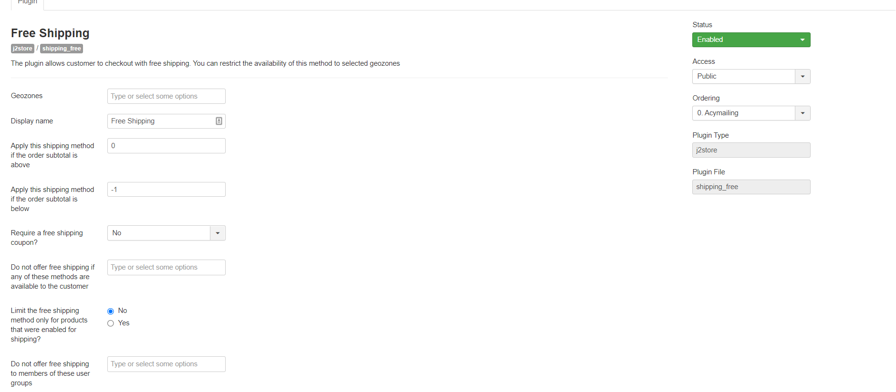

# Free Shipping

With J2Store you can let the customer choose for a Free shipping option in the shipping method selection area of your site. Here is how you can configure the Free shipping for the store.

## Free Shipping Method: 

The Free shipping method is by default available with J2Store shipping methods.

To set the Free shipping method for the store please Follow the below steps:

**Step:1**

Navigate to J2Store-&gt;Setup-&gt;Shipping method-&gt;Free shipping and click on Create/Edit/Link

**Step:2**

Configure the following prams:

**Status:** Set the status to Enabled to keep the Free shipping method active

**Geozone**: If you wish to display the Free shipping to any particular Geozone only then you can consider assigning that Geozone here.

**Display Name:** The value entered here will be displayed as the shipping name in store frontend.

**Apply this shipping method if the order subtotal is above:** If you wish to apply the free shipping to order above a specific order total then you may enter the value here.

For Example: If you wish to apply the Free shipping charge to order of total above $50 then you may enter the value here as 50. So that any order with value above $50 will only be able to avail the Free shipping method.

**Apply this shipping method if the order subtotal is below:** If you wish to apply the free shipping to order below a specific order total then you may enter the value here.

For Example: If you wish to apply the Free shipping charge to order of total below $10 then you may enter the value here as 10. So that any order with value below $10 will only be able to avail the Free shipping method.

**Require Free shipping Coupon:**  Setting this option to Yes will let the customer to view the Free shipping method only when the valid free shipping coupon is entered.

**Do not offer Free shipping if any of these methods are available to the customer:** You can select multiple methods here, so that if any of the selected methods are available, free shipping will not be offered to the customer.

**Limit the Free shipping method only for products that were enabled for shipping:** When set to Yes the method will only show up if the cart has at least one product that was enabled for shipping.

**Do not offer free shipping to members of these user groups:** The members of the selected user groups here will not be able to choose free shipping.

## \*\*\*\* 

\*\*\*\*

