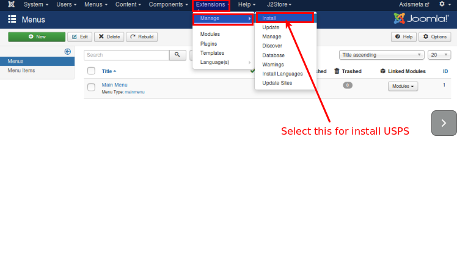
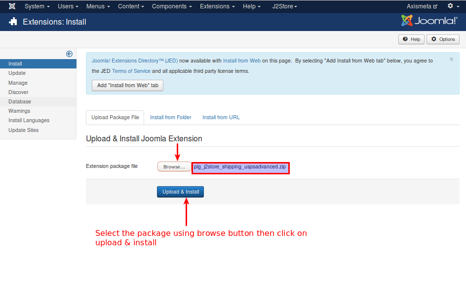
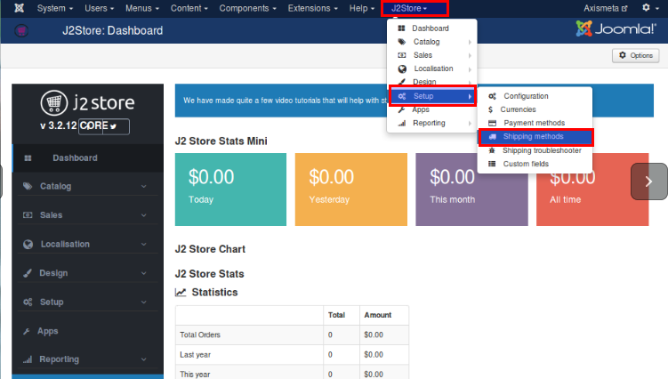
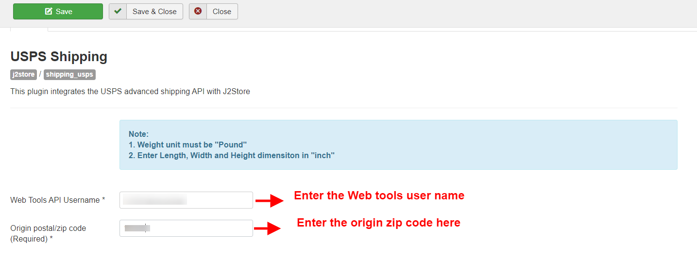
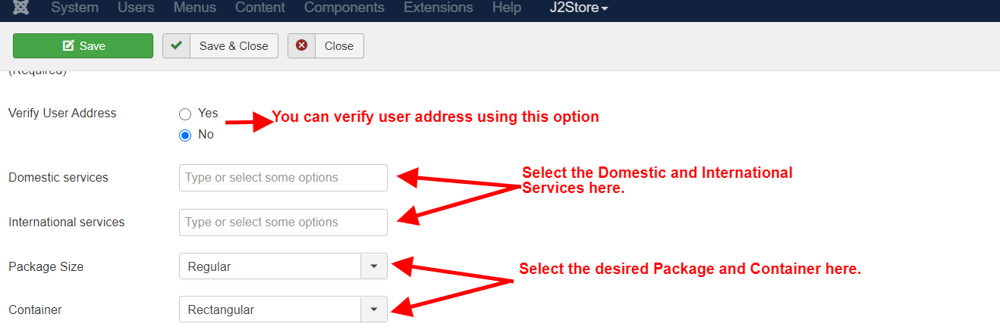
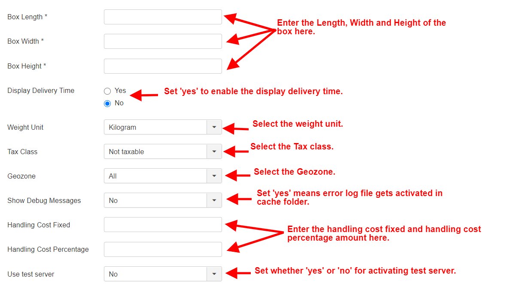

# USPS Shipping

This plugin integrates UPS Shipping Rate API with J2Store.

**Requirements**

* PHP 5.3+
* Joomla 2.5 / 3.x +
* J2Store 2.6.8 +

**Configuration** Prior to configuring the plugin, you should have an active account with the UPS and received API keys. Contact UPS to register and get API keys.

Not sure where to find your Access key ? Read the documentation below &lt;link-text url = ¨[https://help.extensionworks.com/hc/en-us/articles/200366638-Where-do-I-find-my-UPS-license-key-or-Access-Key-”target](https://help.extensionworks.com/hc/en-us/articles/200366638-Where-do-I-find-my-UPS-license-key-or-Access-Key-%22target) = ¨\_blank”rel = ¨noopener¨&gt; click here

**Installation** You can install this USPS shipping plugin, using joomla installer.The following steps help you for successful installation.

**Step 1** In the Joomla admin, go to Extensions -&gt; Extension Manager -&gt;install

 **step 2** Click on the Browse button and select USPS Shipping \(type=j2store\) and click on Upload & Install

 **step 3** Select J2store -&gt;setup -&gt; shipping methods

**Step 4**

* Now, the USPS Advanced shipping for J2Store page will appear on the screen.
* Enable the plugin.
* Configure the shipping plugin by entering the plugin parameters.

## **Parameters:**

**Configuration** **USPS API SETTINGS** **Web Tools Username** Enter the valid username associated with your USPS account.

**Origin postal/ Zip code** Enter the Postcode from where you ship.

Refer the below image

**Verify User Address** You can verify user address using this option. For that you have to enable USPS address validate service, otherwise disable this option.

**Domestic Services :** USPS offered lot of domestic services . You can select more than one service. If you need to know more about the USPS Services please refer the following link USPS.

**International Services** : USPS offers lot of international services. You can add multiple options from the list.

**Package Size :** Choose the Package Size as either Regular or Large from provided option.

**Container :** Choose the container type required from provided dropdown options.

**Machinable :** 

**Send product dimension :** By setting Yes, it will send the product dimension to USPS server and will get you the accurate rate.

**Box Length :** Enter the size of the box length here.

**Box Width :** Enter the size of box width here.

**Box Height :** Enter the size of box height here.

**Display Delivery Time** If you want to show the delivery time means set it yes otherwise set it as no.

**Weight unit** Select the desired unit in which you want to measure the weight, like, kilograms, pounds etc. Preferred unit Pound.

**Tax class** If shipping is taxable and you want to add tax rate, select a tax profile in this option.

**Geozone** If you want to limit this shipping method to particular areas, then you can select the corresponding geozone in this option. If this shipping is applicable to all areas, then set it to All.

**Debug** If you set this to Yes, then an error log file will be maintained in the cache folder. It suitable for test account.

> Set this option to No in live site

**Handling cost** **Fixed :** If you need to charge a handling cost for the shipping, you can enter the fixed cost here.

**Handling cost Percentage :** Enter the percentage of shipping amount added as handling cost.

**Use Test Server** USPS Shipping offers a testing suite called test server. Before going live, you can test your store using USPS test server feature.

\*\*\*\*

\*\*\*\*

